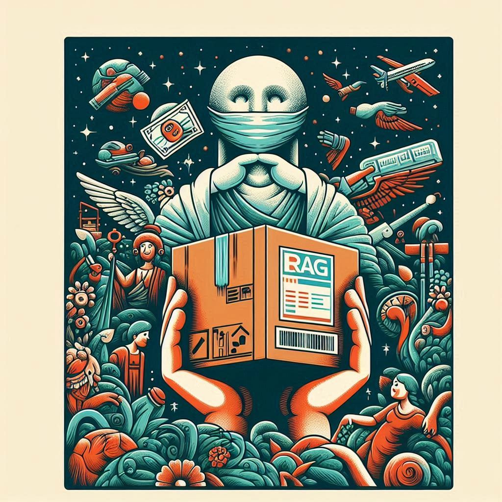
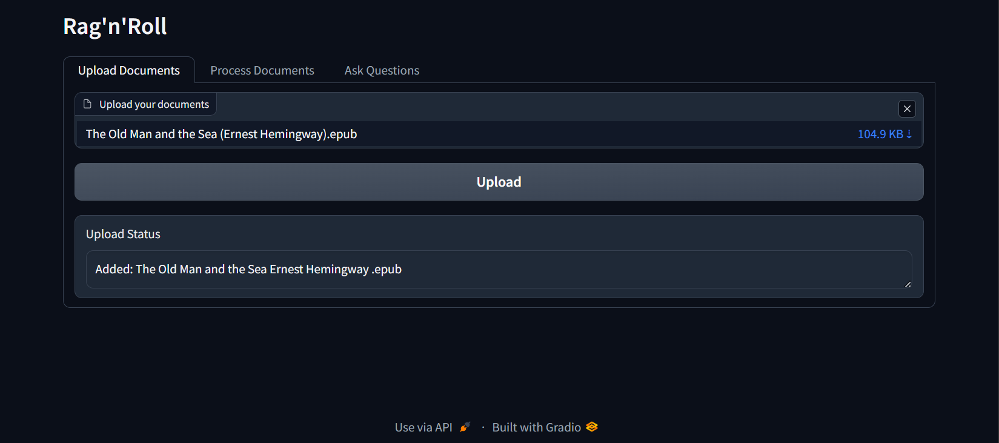
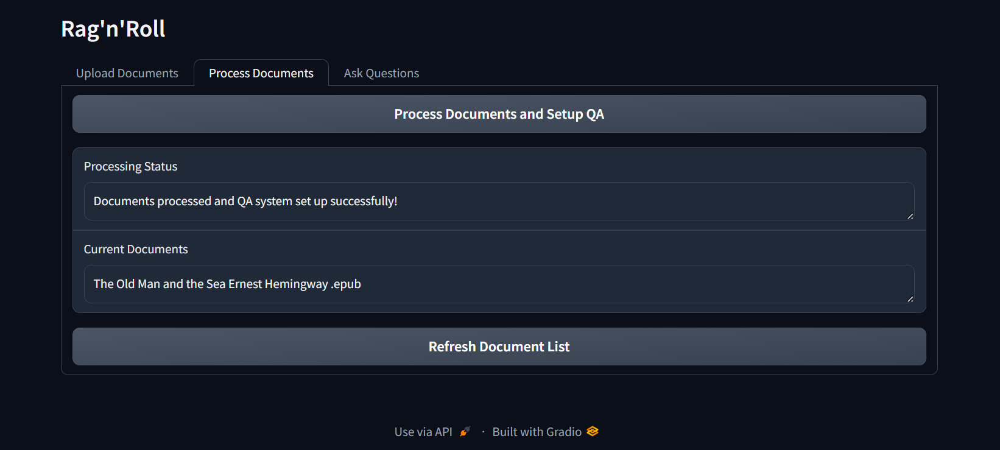
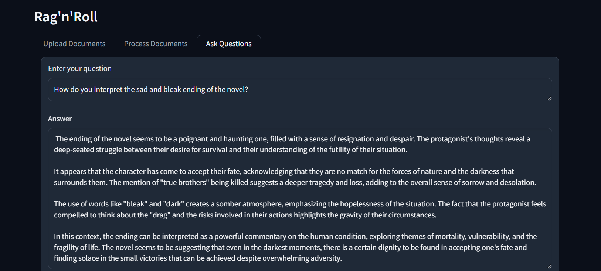

# RAGnRoll

A simple RAG pipeline to query from *any* unstructured document(s), including .eml, .html, .md, .msg, .rst, .rtf, .txt, .xml, .png, .jpg, .jpeg, .tiff, .bmp, .heic, .csv, .doc, .docx, .epub, .odt, .pdf, .ppt, .pptx, .tsv, and .xlsx file formats.

## Upload Documents

## Process Documents

## Ask Questions

